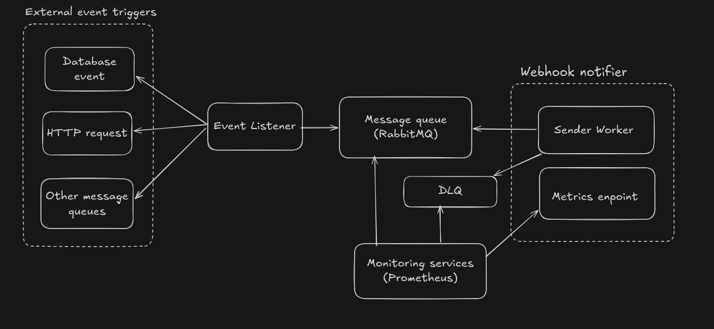
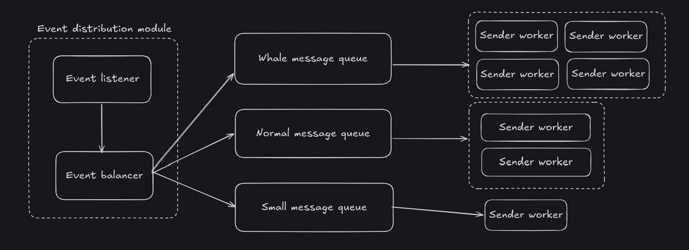
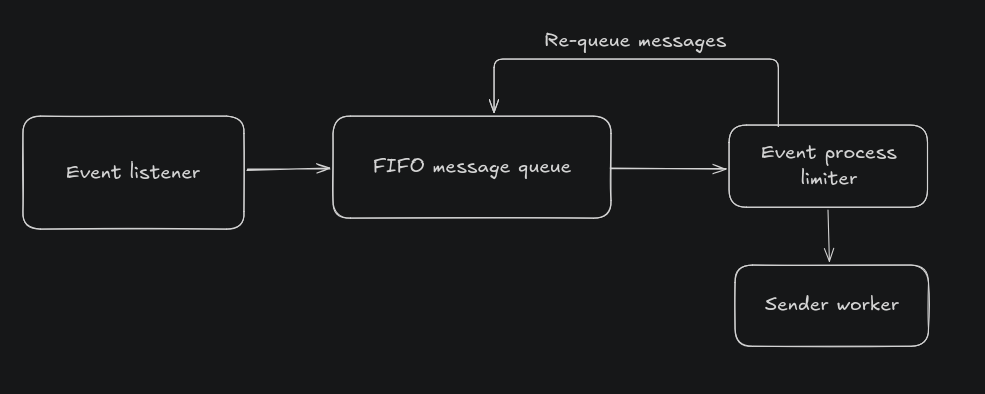

# Webhook Notifier System

A scalable, event-driven webhook notification system with monitoring and dead-letter queue support.

## 🛠️ Technologies Used

### Core Technologies

- **Go 1.24** - Backend services (webhook-notifier, event-listener)
- **TypeScript/Deno** - Mock event trigger service (Why Deno? Because I just want to try it, and it can run TypeScript without config)
- **PostgreSQL 16** - Event persistence and storage
- **RabbitMQ 3** - Message broker
- **Docker & Docker Compose** - Containerization

### Monitoring & Observability

- **Prometheus** - Metrics collection and time-series database
- **RabbitMQ Prometheus Plugin** - Built-in RabbitMQ metrics exporter

---

## 🏗️ Architecture Overview



### Problems Solved

This POC addresses these main challenges:

1. **Reliability** - Messages won't be lost even if services fail
2. **Scalability** - Handle high message volume by adding more workers
3. **Testing** - I know the code has limited testability (tight coupling with HTTP client, DB, RabbitMQ). Since this is just a POC and I didn't have time to refactor everything for proper dependency injection, I only wrote a basic test for the webhook sender. Full test coverage would require more refactoring.
4. **Fairness** - Prevent whale accounts from overwhelming the system by using multiple queues with different resource allocations



**How Fairness Works:**
- **Event Balancer** - Routes events to different queues based on account size
- **Whale Queue** - High-volume accounts get processed by 4 dedicated workers with higher resources
- **Normal Queue** - Medium accounts processed by 2 workers
- **Small Queue** - Small accounts processed by 1 worker

This ensures small accounts don't get starved when whale accounts trigger lots of events. Each queue has dedicated workers, so resource allocation is fair.

**Alternative Solution - Rate Limiting with Token Bucket:**



Instead of multiple queues, we can use a **rate limiter** approach:
- **Event Process Limiter** - Checks user's current API call count or resource usage before processing
- **Token Bucket Algorithm** - Each user has a limit (e.g., 1000 concurrent API calls)
- **Re-queue on Limit** - When user A hits their limit, request #1001 gets put back into the queue
- **FIFO Processing** - Messages are processed in order, but rate-limited per user

This prevents any single user from monopolizing system resources while maintaining fairness.

### Services Explained

**PostgreSQL + Mock Service**
- For POC demonstration only
- Simulates how events might be triggered
- Real implementation could use webhooks, APIs, or other event sources

**Event Listener (Adapter)**
- Receives events from any source (database, webhooks, APIs, etc.)
- Adapts different event formats into standardized queue messages
- Pushes messages to RabbitMQ
- Decoupling layer between event sources and processing

**RabbitMQ**
- Message broker with Dead Letter Queue (DLQ)
- Distributes work across workers
- Failed messages go to DLQ for inspection

**Webhook Notifier**
- Worker pool (3 workers) processes messages concurrently
- Sends HTTP POST to webhook URLs
- Retry logic with exponential backoff
- Exposes Prometheus metrics

**Prometheus**
- Monitors queue depth and processing rates
- Tracks success/failure metrics

### How It Ensures Reliability

- **Message acknowledgment** - Messages only removed after successful send
- **Dead Letter Queue** - Failed messages preserved for analysis
- **Retry with exponential backoff** - Automatic retries for transient failures

### How It Scales

**Design Decision:**
- **Stateless notifier** - No shared state between workers, enabling horizontal scaling
- **Worker pool** - Vertical scaling experiment with 3 workers per instance

**Scaling Strategies:**
- **Horizontal scaling** - Deploy multiple webhook-notifier containers (stateless design)
- **Vertical scaling** - Increase workers per container (worker pool pattern)
- **Queue-based distribution** - RabbitMQ automatically balances load across all workers

---

## 🚀 Getting Started

### Prerequisites

- **Docker & Docker Compose** - For running infrastructure services
- **Go 1.24+** - For running Go services locally
- **Deno** - For running the mock event trigger service

### Step 1: Start Infrastructure Services

```bash
# Start PostgreSQL, RabbitMQ, and Prometheus
docker-compose up -d
```

This will start:

- **PostgreSQL** on port `5432`
- **RabbitMQ** on ports `5672` (AMQP) and `15672` (Management UI)
- **Prometheus** on port `9090`

### Step 2: Enable RabbitMQ Prometheus Plugin

```bash
docker exec -it rabbitmq rabbitmq-plugins enable rabbitmq_prometheus
docker-compose restart rabbitmq
```

### Step 3: Start Event Listener

```bash
cd event-listener
go mod download
go run cmd/listener/main.go
```

You should see:

### Step 4: Start Webhook Notifier

```bash
cd webhook-notifier
go mod download
go run cmd/notifier/main.go
```

``

### Step 5: Start Mock Event Trigger (Optional)

```bash
cd mock-services
deno run --allow-net --allow-read --allow-env mock-webhook-trigger.ts
```

This starts a web UI on `http://localhost:3000` where you can trigger test events.

### Step 6: Verify Everything is Running

#### Check Service Health

```bash
# PostgreSQL
docker-compose ps postgres

# RabbitMQ Management UI
open http://localhost:15672
# Login: guest/guest

# Prometheus Targets
open http://localhost:9090/targets
```

All targets should show as **UP** ✅

#### Check Metrics Endpoints

```bash
# Webhook Notifier metrics
curl http://localhost:8080/metrics | grep webhook_messages

# RabbitMQ metrics
curl http://localhost:15692/metrics | grep rabbitmq_queue
```

### Step 7: Send a Test Event

1. Open `http://localhost:3000`
2. Edit the JSON payload
3. Click "Add to Database"

### Step 8: Verify the Event Flow

1. **Check Event Listener logs** - Should see "Event pushed to queue"
2. **Check Webhook Notifier logs** - Should see "Worker X is processing..."
3. **Check RabbitMQ UI** - `http://localhost:15672/#/queues` - Messages processed
4. **Check Prometheus metrics** - `http://localhost:9090/graph`
   - Query: `webhook_messages_received_total`
   - Query: `webhook_messages_processed_total`

---

## 📝 Quick Commands (For copy and run)

### Enable RabbitMQ Prometheus Plugin

```bash
docker exec -it rabbitmq rabbitmq-plugins enable rabbitmq_prometheus
```

### Reload Prometheus Configuration

```bash
curl -X POST http://localhost:9090/-/reload
```

---

## 🤖 AI Usage

I use Claude Sonnet 4.5

**Used for:**

- Writing documentation and fixing grammar
- Debugging Go code and fixing syntax errors (limited Go experience)
- Creating HTML/CSS UI code
- Implementing Prometheus metrics

---

## 📊 Available Metrics

### Webhook Notifier Metrics

```promql
webhook_messages_received_total
webhook_messages_processed_total
webhook_messages_failed_total
```

### RabbitMQ Metrics

```promql
rabbitmq_queue_messages
rabbitmq_queue_messages_ready
rabbitmq_queue_messages_unacknowledged
rabbitmq_queue_consumers
rabbitmq_queue_messages_published_total
rabbitmq_queue_messages_delivered_total
```

### Useful Queries

```promql
# Queue depth
rabbitmq_queue_messages{queue="webhook_queue"}

# Messages in DLQ
rabbitmq_queue_messages{queue="webhook_queue_dlq"}

# Success rate
(webhook_messages_processed_total / webhook_messages_received_total) * 100

# Check if services are up
up
```
